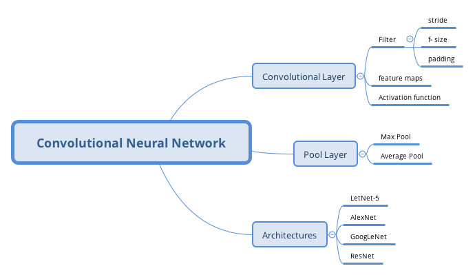

# Exercise 

1. What are the advantages of a CNN over a fully connected DNN for image classification?

2. Consider a CNN composed of three convolutional layer, each with 3 × 3 kernels, a stride of 2, and SAME padding. The lowest layer output 100 features maps, the middle one outputs 200, and the top one outputs 400. The input images are RGB images of 200 × 200 pixels. What is the total numbers of parameters in the CNN? If we are using 32-bit floats, at least how much RAM will this network require when making a prediction for a single instance? What about when training on a mini-batch of 50 images?

3. If your GPU rans out of the memory while training a CNN, what are five things you could try to solve the problem?

4. Why would you want to add a max pooling layer rather than a convolutional layer with the same stride?

5. When would you want to add a *local response normalization* layer?

6. Can you name the main innovations in AlexNet, compared to LetNet-5? What about the main innovations in GoogLeNet and ResNet?
